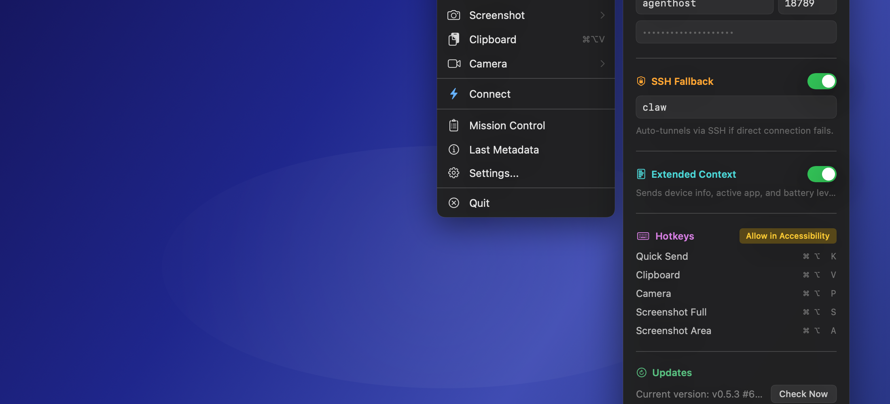
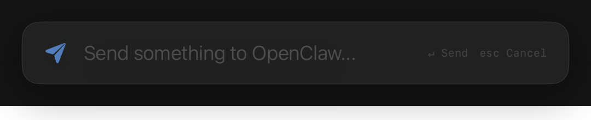
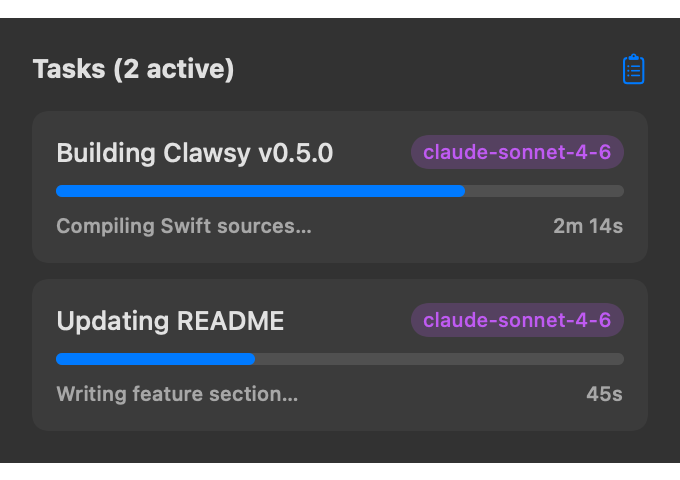
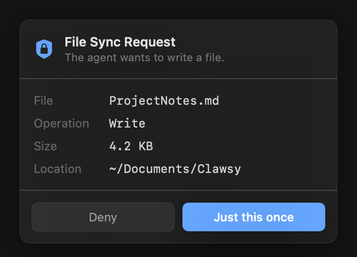
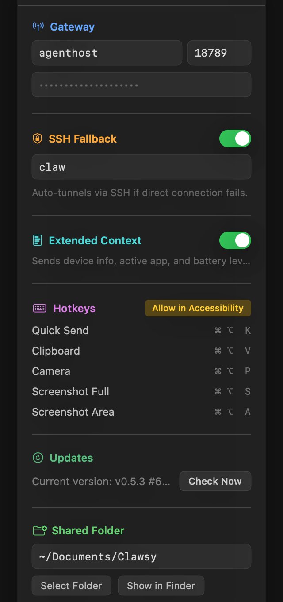

<h1 align="center">Clawsy</h1>

<p align="center">
  <strong>Your AI agent, fully wired into your Mac.</strong><br>
  A native menu bar app that gives <a href="https://github.com/openclaw/openclaw">OpenClaw</a> agents real-world reach — screen, clipboard, camera, files — while keeping you in control.
</p>

<p align="center">
  
  
  
  
</p>

<p align="center">
  
</p>

---

## Install

1. Download **Clawsy.app.zip** from the [Releases](https://github.com/iret77/clawsy/releases) page
2. Unzip → drag `Clawsy.app` to `/Applications`
3. Launch — the setup assistant handles the rest

> Requires macOS 14+. No cloud account. No subscription. No telemetry.

---

## What it does

Clawsy sits in your menu bar and acts as a secure bridge between your Mac and your OpenClaw agent. Your agent can see your screen, read your clipboard, manage files, and track its own tasks — all with your explicit approval.

### ⚡ Quick Send

A global hotkey (`⌘⇧K`) opens a floating panel anywhere on your Mac. Type a message to your agent without switching apps or opening a chat window.

<p align="center">
  
</p>

### 📋 Clipboard, Screen & Camera

Push your clipboard to the agent silently. Let the agent request a screenshot or camera frame. Every request goes through a permission dialog — allow once, for an hour, or deny.

### 📁 Shared Folder & Automation Rules

A local folder syncs with your agent's workspace. Drop a `.clawsy` rule file into any subfolder to define triggers — *"when a PDF is added, summarize it"*. No JSON editing. Right-click any folder in Finder to configure rules via the FinderSync extension.

### 📊 Mission Control

See what your agent is actually doing, in real time.

<p align="center">
  
</p>

Agents write their task status to `.agent_status.json` in the shared folder. Clawsy picks it up instantly.

### 🔒 You Stay in Control

Every file write, screenshot, or clipboard read requires your approval.

<p align="center">
  
</p>

Nothing happens behind your back. You can always see what was approved and when.

---

## Setup

Open the Clawsy menu → **Settings**:

<p align="center">
  
</p>

| Setting | Description |
|---|---|
| **Gateway Host** | Your OpenClaw server hostname or IP |
| **Gateway Port** | Default: `18789` |
| **Token** | Your OpenClaw agent token |
| **SSH Fallback** | Auto-tunnels via SSH if direct connection fails |
| **Shared Folder** | Local folder synced with your agent |

---

## Agent Integration

Once paired, your agent can invoke Clawsy directly:

```python
# Take a screenshot
nodes(action="invoke", node="<nodeId>", invokeCommand="screen.capture")

# Read the clipboard
nodes(action="invoke", node="<nodeId>", invokeCommand="clipboard.read")

# Write a file to the shared folder
nodes(action="invoke", node="<nodeId>", invokeCommand="file.set",
      invokeParamsJson='{"name": "notes.txt", "content": "<base64>"}')
```

See [CLAWSY.md](CLAWSY.md) for the full skill documentation.

---

## Build from Source

```bash
git clone https://github.com/iret77/clawsy.git
cd clawsy
./build.sh
# → Clawsy.app lands in .build/app/
```

Requires Swift 5.9+ (Xcode Command Line Tools). CI builds run automatically on every tagged release via GitHub Actions.

---

## License

MIT — see [LICENSE](LICENSE).
